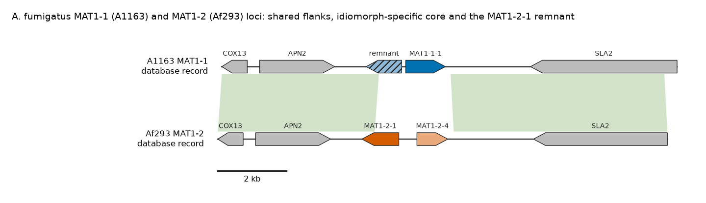
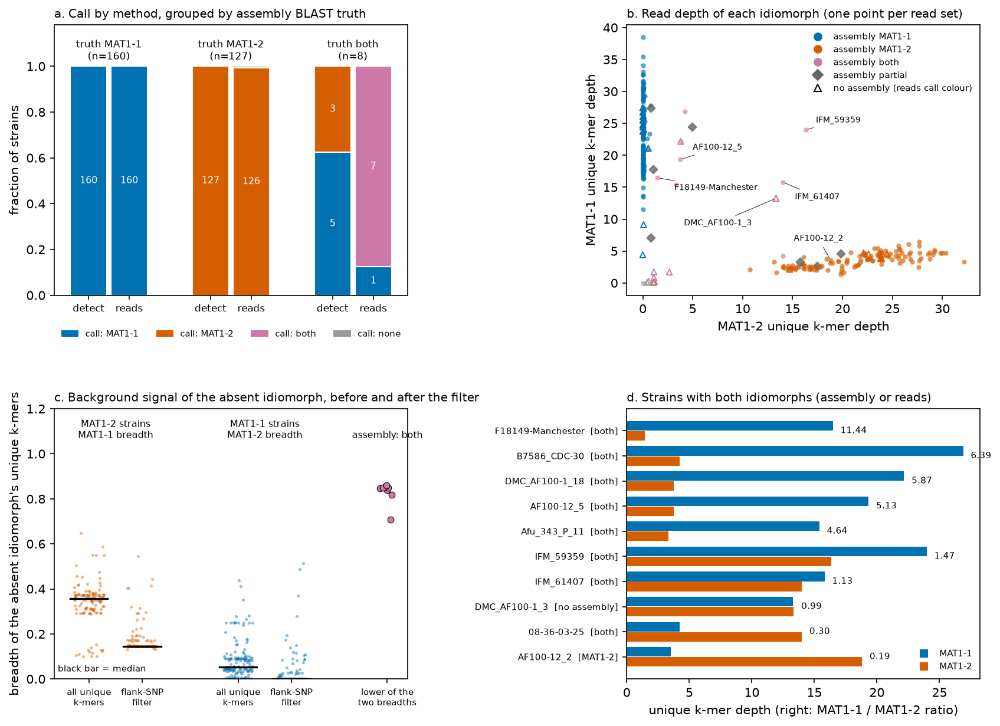
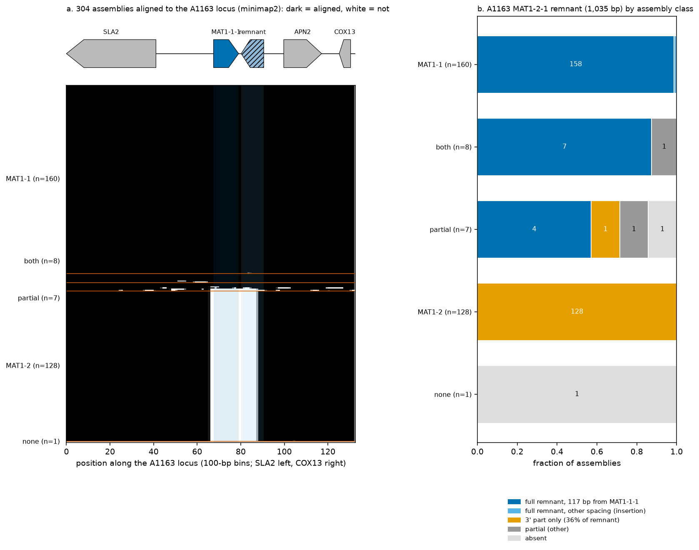
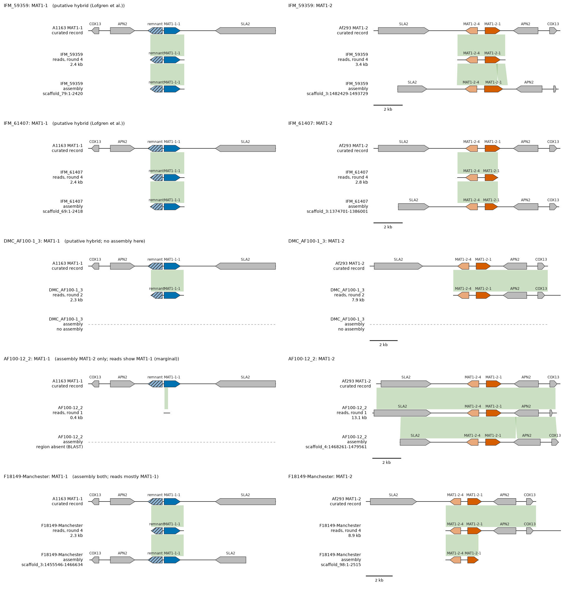

# Aspergillus fumigatus: MAT typing from 304 assemblies and 331 read sets
Status: open (first full profile; decisions below are open)

## Question
How well are MAT1-1 and MAT1-2 retrieved from assemblies (`detect`) and from raw reads (`matpredict reads-type`) in a large *A. fumigatus* population set, and how do the two compare? Tool and method: [2026-10-06_fola-reads-type.md](2026-10-06_fola-reads-type.md) (Fola benchmark, mixes, blastx and recruit tests).

## Data and code version
- Code: branch `afum-reads-type` (stacked on `reads-type`, PR #45), `matpredict reads-type` with `--min-unique-run 100`. `detect`: frozen worktree `.claude/worktrees/run-2d1860a` (main at PR #41), `--taxid 746128`.
- Database: the same tree as the `detect` code. The panel uses records `746128_a1163_MAT_MAT1-1` and `746128_af293_MAT_MAT1-2`.
- Inputs (`results/2026-10-07_afum_reads/strain_map.tsv`):
  - Assemblies: `/bigdata/stajichlab/shared/projects/Afumigatus_pangenome/scaffolded/genomes/*.sorted.fasta`, 304 files.
  - Reads: `/bigdata/stajichlab/shared/projects/Afum_popgenome/asm/input/`, 331 read sets from `asm/samples.dat` (column 1 = read-file prefix, column 2 = strain = genome name). 311 are paired and 20 are single-end (`_R1` only; typed as one file).
  - 303 genomes have reads (Af10 has none); 28 read sets have no genome. 20 DMC and DMC2 pairs (for example DMC_AF100-1_3 and DMC2_AF100-1_3) give identical read results, so they are duplicates under two names.

## Method
1. Panel (`panels/aspergillus_fumigatus/`): the curated database records `746128_a1163_MAT_MAT1-1` (A1163, DS499596.1, 13,260 bp) and `746128_af293_MAT_MAT1-2` (Af293, NC_007196.1, 13,096 bp), whole locus segments with the flank genes. The two segments align at 99.3% over the flanks. The idiomorph-specific regions are MAT1-1 positions 4,576 to 6,664 (2,089 bp) and MAT1-2 positions 6,225 to 8,525 (2,301 bp) (`specific_regions.fasta`).
2. Assembly truth (`scripts/assembly_idiomorph_blast.py`, `blast/assembly_truth.tsv`): BLASTN of the two specific regions against each assembly (identity >= 90%, e-value 1e-10); present if >= 0.80 of the region is covered, absent if <= 0.20, otherwise partial. Result for 304 genomes: MAT1-1 only 160, MAT1-2 only 128, both 8, partial 7 (excluded from agreement counts), neither 1 (Moose_3-1.1).
3. `detect` (job 29605756) on all 304 assemblies; `reads-type` (jobs 29605757 first run, 29606456 with the filter) on 331 read sets, first 8M reads each, panel `panels/aspergillus_fumigatus/`; `scripts/afum_compare.py` joins the three calls per strain.

4. Degenerate MAT1-2-1 remnant (`scripts/afum_remnant.py`, `results/2026-10-07_afum_reads/remnant/`). Reference: the A1163 assembly of the pangenome folder (`A1163.sorted.fasta`, scaffold_3). tblastn of the database proteins places SLA2 at 1,653,631-1,657,740, MAT1-1-1 at 1,660,381-1,661,535, the remnant (gene AFUB_042890, EDP53119.1; 1,035 bp covered by protein hits, the record's gene model is 1,038 bp) at 1,661,652-1,662,686, APN2 at 1,663,604-1,665,343 and COX13 at 1,666,150-1,666,672. For each of the 304 assemblies: minimap2 `-x asm5 -c` to a 240-kb slice of that scaffold (1,540,000-1,780,000), CIGAR lift-over of the remnant and MAT1-1-1 intervals, and BLASTN (identity >= 90%) of the A1163 remnant and MAT1-1-1 sequences. "Same location" = the strain's remnant hit lies on the lifted-over contig within 1 kb of the lifted interval. Aligning each whole assembly to the whole A1163 assembly took about 7 minutes per strain (4 strains in 7.7 minutes before I stopped it); the slice gave identical rows for the two test strains I ran both ways (IFM_59359, 08-12-12-13), took 2.6 seconds each in that test, and the job over all 304 assemblies ran for about 35 minutes (4 in parallel, I/O-bound).
5. Loci drawn from reads (`results/2026-10-07_afum_reads/recruit/`, job 29607847). Reads of 8 strains (the hybrid and weak-signal strains plus controls A1163 and Af293) were mapped to the two curated locus segments (minimap2 `-ax sr`; round 1 without a MAPQ filter, later rounds MAPQ >= 10), read pairs with a mapped mate were assembled (SPAdes `--careful`), and the contigs were mapped again for up to 4 rounds. Gene arrows in the maps are tblastn hits of the curated record proteins on every track, the same method for assemblies and read contigs (`scripts/figures/protein_genes.py`); they are not annotations. `detect` was not run on these read contigs.

## Results
**A panel flaw found and fixed.** With the first run (all unique k-mers), reads agreed with the assembly truth in 288 of 296 strains (97.3%), and 6 MAT1-2 assemblies were called `both`. In MAT1-2 strains the MAT1-1 "unique" k-mers had median breadth 0.351 and about half the MAT1-2 depth, as high as the signal in those 6 strains. Cause: the A1163 and Af293 flanks differ by SNPs, and every k-mer that spans a SNP counted as idiomorph-unique, and matches any strain with that flank allele. Fix (`Panel.from_sequences(min_run=100)`, option `--min-unique-run`, default 100): keep a unique k-mer only if it lies in a run of at least 100 consecutive unique positions (a SNP gives a run of at most 31). It removes 1,175 of 3,739 MAT1-1 and 1,168 of 3,575 MAT1-2 unique k-mers in this panel (31%), and 111 of 4,828 and 92 of 4,711 in the Fola panel (2%). Tests: 3 new, 47 pass with the smoke test. The rule was chosen after seeing the first result, so the 99.0% below is not an independent test of it. Fola is unchanged: 147/148 (`v4_concordance.tsv`).

Results with the filter (`comparison.tsv`; excluding the 7 partial and the 28 reads-only strains):
| Method | Agree with assembly truth |
|---|---|
| reads-type, 8M reads | 293/296 (99.0%); without the 20 DMC2 duplicates 280/283 |
| `detect` on assemblies (frozen run-2d1860a) | 288/297 (97.0%); without the DMC2 duplicates 275/284 |
- reads-type: MAT1-1 160/160, MAT1-2 126/127, both 7/8. Differences: AF100-12_2 (below), F18149-Manchester (below), Moose_3-1.1 (`low_depth`).
- `detect`: all 288 assemblies with one idiomorph got the right idiomorph (160 MAT1-1, 128 MAT1-2), 0 missed. All 8 assemblies with both regions got a single call (5 MAT1-1, 3 MAT1-2); the second idiomorph is not reported. All 304 genomes had at least one locus; 185 loci high and 120 medium confidence; no run failed.
- All reads (331): MAT1-1 174, MAT1-2 135, both 18, low_depth 4. Reads-only strains (28): MAT1-1 11, MAT1-2 7, both 7, low_depth 3.

The 8 assemblies with both regions (read depths, MAT1-1 / MAT1-2, k-mer units): 08-36-03-25 4.3/14.0, AF100-12_5 19.3/3.8, Afu_343_P_11 15.4/3.3, B7586_CDC-30 26.9/4.2, DMC_AF100-1_18 22.2/3.8, IFM_59359 24.0/16.4, IFM_61407 15.8/14.0: all `both` from reads. F18149-Manchester: reads call MAT1-1 (16.5) with MAT1-2 at 1.4 (breadth 0.71, flagged `trace_MAT1-2`), so the reads support the second region only weakly although the assembly holds both. Two of the three Lofgren et al. putative hybrids (IFM_59359, IFM_61407) are `both` from reads and from the assembly regions; `detect` reports MAT1-2 only (medium) for both. The third (AF100-1_3) has no assembly in this folder; its reads (DMC_AF100-1_3, DMC2_AF100-1_3) are `both`, at 13.3 / 13.4.

Reads show a second idiomorph that the assembly lacks: AF100-12_2 (assembly MAT1-2 only; reads MAT1-1 depth 3.5 against MAT1-2 18.8, MAT1-1 breadth 0.546). It is marginal: in the 126 MAT1-2 strains called MAT1-2 the MAT1-1 breadth has median 0.144 and maximum 0.443, and all 126 carry a `trace_MAT1-1` flag. In the 160 MAT1-1 strains the MAT1-2 breadth has median 0.000, maximum 0.514, and 46 carry a flag.

`detect` findings that are not read-typing results:
- 168 of the 169 MAT1-1 loci are labelled `homothallic_candidate`, and none of the 135 MAT1-2 loci are (`mat_locus`). The A1163 database record carries a degenerate MAT1-2-1 remnant as a core gene, and the class rule (`idiomorph.py`, both idiomorphs' core genes on one locus) fires on it. For *A. fumigatus* this label is therefore not evidence of homothallism. I did not change the record or the rule.
- Moose_3-1.1: `detect` reports MAT1-2 (high, scaffold_3:476,818-485,874) and MAT1-1 (medium, `partial_locus`, scaffold_3:1,319,318-1,326,086), 840 kb apart. Neither specific region matches the assembly at 90% identity, and its reads have shared depth 0.02, so the reads are not from an *A. fumigatus*-like genome. The species of this sample was not checked.

### Figures

**Figure 1.** The two curated *A. fumigatus* locus segments (database records `746128_a1163_MAT_MAT1-1`, `746128_af293_MAT_MAT1-2`), drawn in one orientation; green ribbons are BLASTN blocks (>= 85% identity). The flanks (COX13, APN2 and SLA2) are shared; the central 2.1 kb (A1163) and 2.3 kb (Af293) are idiomorph-specific. The hatched A1163 gene is the degenerate MAT1-2-1 remnant. Script: `scripts/figures/fig_afum_reference_loci.py`.

**Figure 2.** (a) Calls of `detect` and `reads-type`, grouped by the assembly BLAST truth; numbers are strains (the 7 partial and 28 reads-only strains are not in this panel; the MAT1-2 group has 127 strains because Af10 has no reads). `detect` calls one idiomorph for each of the 8 assemblies that hold both. (b) Unique k-mer depth of each idiomorph for every read set (331); hollow triangles have no assembly. (c) Breadth of the absent idiomorph's unique k-mers, before (all unique k-mers) and after the flank-SNP filter; black bar = median. (d) The strains with both idiomorphs; the number is the MAT1-1 / MAT1-2 depth ratio. Script: `scripts/figures/fig_afum_overview.py`; data: `comparison.tsv`, `reads_type_v1_unfiltered.tsv`, `reads_type_v2.tsv`.

### Degenerate MAT1-2-1 remnant: present, and at the same place, in every MAT1-1 assembly

**Figure 3.** (a) Alignment of each of the 304 assemblies to the A1163 locus (minimap2): dark = aligned, white = not; rows are grouped by assembly truth and sorted by coverage. All 128 MAT1-2 assemblies have the same unaligned block, scaffold_3:1,660,231-1,662,431 (2.2 kb; the same 100-bp bins in every one), which matches the idiomorph-specific region of the A1163 segment (1,660,227-1,662,315); the flanks align in all. The MAT1-1 assemblies align across the whole locus. (b) Status of the 1,035-bp remnant by class. Script: `scripts/figures/fig_afum_remnant.py`; data: `remnant/remnant_summary.tsv`, `remnant/locus_strip.tsv`.

- MAT1-1 assemblies (160): all carry the remnant (BLASTN coverage 0.964 to 1.0; top-hit identity median 99.9%, minimum 99.0%) and all 160 lie in the lifted-over position. 158 have the A1163 spacing, 117 bp between the remnant and the MAT1-1-1 region. Two differ: AF100-10A (the remnant is split by a 136-bp insertion with a 77-bp duplication; spacing of the first part is still 117 bp) and AZTEC_20_243 (300 bp of the remnant are replaced by a 513-bp insertion; coverage 0.964). I read these two from the BLAST hit coordinates and did not look at the sequences.
- MAT1-2 assemblies (128): none carry the full remnant. Each has only a 3' stretch covering 36% of it (coverage 0.356 or 0.358, identity 96.0 to 97.3%). That stretch is the part shared with the real MAT1-2-1 gene (the record says the C-terminal ~100 residues of the remnant are nearly identical to Af293 MAT1-2-1), so a hit there is not a remnant.
- Assemblies with both regions (8): all 8 have the remnant 117 bp from MAT1-1-1; 7 cover >= 0.9 of it, and IFM_61407 covers 0.833 because its MAT1-1 scaffold (scaffold_69, 2.4 kb) starts inside the remnant. In IFM_59359 and IFM_61407 the remnant sits on that short scaffold, not next to the MAT1-2 locus.
- Partial class (7): 4 carry the full remnant at 117 bp; M128 has only the 3' stretch; B9781_CDC-19 has 0.75; AZTEC_16_237 has none. Moose_3-1.1 has none.
- So in this set the remnant is a constant feature of the MAT1-1 locus: same position, same spacing to MAT1-1-1 in 158 of 160, and nearly identical sequence. `detect` finds it as a MAT1-2-1 gene next to MAT1-1-1; this is why 168 MAT1-1 loci get the class `homothallic_candidate` (see above).

### Hybrid and weak-signal strains drawn from the assembly and from the reads

**Figure 4.** For each strain, the MAT1-1 locus (left) and MAT1-2 locus (right) as the curated reference (top), the contig assembled from the strain's reads (middle) and the whole-genome assembly (bottom, window around the BLAST hit); green ribbons are BLASTN blocks (>= 92%). Dashed = nothing found in that data type. Script: `scripts/figures/fig_afum_hybrid_loci.py`; contents of each track: `figures/afum_hybrid_loci.tsv`.

| Strain | MAT1-1 core from reads | MAT1-1 in assembly | MAT1-2 locus from reads | MAT1-2 in assembly |
|---|---|---|---|---|
| IFM_59359 (round 4) | 2.4-kb contig, MAT1-1-1 + remnant, no flanks | scaffold_79, 2.4 kb, no flanks | 3.4-kb contig, MAT1-2-4 + MAT1-2-1, no flanks | scaffold_3, all flank genes |
| IFM_61407 (round 4) | 2.4-kb contig, MAT1-1-1 + remnant | scaffold_69, 2.4 kb | 2.8-kb contig, MAT1-2-4 + MAT1-2-1 | scaffold_3, all flank genes |
| DMC_AF100-1_3 (round 2) | 2.3-kb contig, MAT1-1-1 + remnant | no assembly | 7.9-kb contig, MAT1-2-4, MAT1-2-1, APN2, COX13 | no assembly |
| AF100-12_2 (round 1) | 0.4-kb fragment, no gene | not in assembly | 13.1-kb contig, all flank genes | scaffold_4, all flank genes |
| F18149-Manchester (round 4) | 2.3-kb contig, MAT1-1-1 + remnant | scaffold_3, all flank genes | 8.9-kb contig, MAT1-2-4, MAT1-2-1, APN2, COX13 | scaffold_98, 2.5-kb, no flanks |

- The two Lofgren et al. hybrids IFM_59359 and IFM_61407 have the same arrangement in the reads and in the assembly: a complete MAT1-2 locus on scaffold_3, and a separate 2.4-kb contig with MAT1-1-1 and the remnant but no flank genes. The contig is too short to say where the MAT1-1 copy lies in the genome.
- DMC_AF100-1_3, which has no assembly in the folder, has both loci from reads alone (round 2).
- AF100-12_2: the reads give no MAT1-1 locus, only a 0.4-kb fragment with no gene, although the k-mer call is `both` (MAT1-1 breadth 0.546). This is another reason to treat that call as marginal.
- F18149-Manchester: the assembly has a complete MAT1-1 locus and a 2.5-kb MAT1-2 scaffold; the reads give an 8.9-kb contig with the MAT1-2 core and APN2 and COX13. The flank genes are shared by both idiomorphs, so that contig does not show that the MAT1-2 core is linked to them. The coverage figures in the SPAdes contig names are dominated by the shared flanks and are not per-idiomorph depth. The k-mer depth of MAT1-2 is 8% of MAT1-1.
- Controls: A1163 and Af293 reads each assemble into a single contig (15.4 kb and 18.1 kb after round 4) that spans the whole curated locus.
- DMC_AF100-1_3, AF100-12_2 and AF100-12_5 (the last is not drawn) were stopped by me after about one hour in a SPAdes step (round 3 for DMC_AF100-1_3, round 2 for the other two). Their recruited read sets were large (round 2 of DMC_AF100-1_3 used 25,296 pairs and gave 562 scaffolds). The maps therefore show round 2 (DMC_AF100-1_3) and round 1 (AF100-12_2).

## What changed in detection
- New in `reads-type`: `--min-unique-run` (`src/MATPredict/reads/panel.py`). No change to `detect`, the database, or any classifier.
- New analysis scripts: `scripts/afum_remnant.py` and `scripts/figures/` (`locusplot.py`, `protein_genes.py`, `gff_genes.py` and the `fig_*.py` files). They need the pixi python (matplotlib, BLAST+); the inputs are paths under `/bigdata/...`, so they run on HPCC.

## Limits
Limits: the assembly truth uses regions from the same two reference strains as the panel; it is independent of the reads but not of the reference choice. 20 duplicate read-set pairs inflate n. Only the first 8M reads were used; single-end samples (20) have half the reads of a pair at the same cap. A `both` call does not separate a heterokaryon, a diploid, a mixed culture or contamination. Reads-only strains have no truth. Cut-offs (breadth 0.50, relative depth 0.10, `min_run` 100) are untested outside Fola and this set.
- The remnant analysis uses A1163 as the single reference; a different MAT1-1 reference would give different coordinates, not different presence. The "same location" test is relative to the A1163 locus and a 240-kb slice of it; it does not test the rest of the genome. Two insertions inside the remnant were not examined at sequence level. The BLAST thresholds (90% identity) and the 1-kb tolerance were fixed before the run.
- The hybrid maps come from 5 strains chosen for their signal. Read contigs share the flank sequence between the two idiomorphs, so a contig carrying one idiomorph core plus the flanks shows no physical linkage. The read assemblies of three strains stopped before the later rounds (see above).

## Curator decisions
Made: none yet.
- Open: keep `--min-unique-run` at 100.
- Open: The `homothallic_candidate` label on every *A. fumigatus* MAT1-1 locus: change the record (drop the remnant from the core genes), the rule, or leave and note.
- Open: Species of Moose_3-1.1.
- Open: Whether the second idiomorph in AF100-12_2, AF100-12_5, F18149-Manchester is a mixed sample (the AF100-12 series suggests one lab series) and who holds the cultures.
- Open: Whether `detect` should get the report-only "unlinked second idiomorph" check noted in the spec.

## Files
- `results/2026-10-07_afum_reads/`: `strain_map.tsv`, `assembly_truth.tsv`, `comparison.tsv` (per strain: truth, `detect` call, reads call, depths), `reads_type_v2.tsv`, `detect.slurm`, `reads_type_run_v2.slurm`, `blast_run.slurm`.
- `panels/aspergillus_fumigatus/` (MAT1-1.fasta, MAT1-2.fasta, specific_regions.fasta).
- `scripts/assembly_idiomorph_blast.py`, `scripts/afum_compare.py`, `scripts/afum_remnant.py`, `scripts/figures/`.
- `analysis/figures/`: `afum_reference_loci.png`, `afum_overview.png`, `afum_remnant.png`, `afum_hybrid_loci.png`, `afum_hybrid_loci.tsv`.
- `results/2026-10-07_afum_reads/remnant/` (`remnant_summary.tsv`, `locus_strip.tsv`, `run.slurm`) and `results/2026-10-07_afum_reads/recruit/` (`rounds.tsv` per strain, `strains.tsv`, `run.slurm`).
- Full `detect` reports (304 genomes) stay in the main checkout, `results/2026-10-07_afum_reads/detect/runs/` (not tracked).
